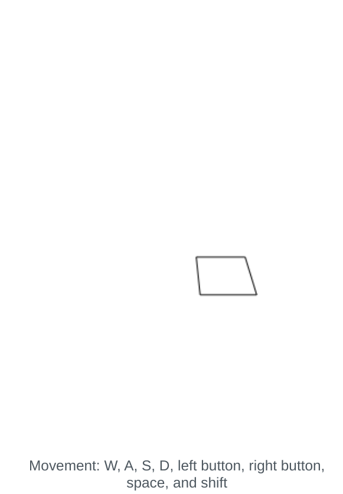
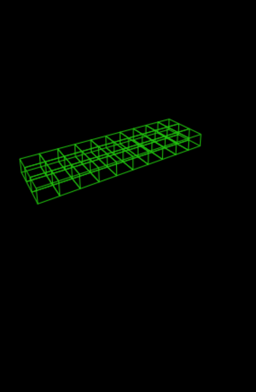
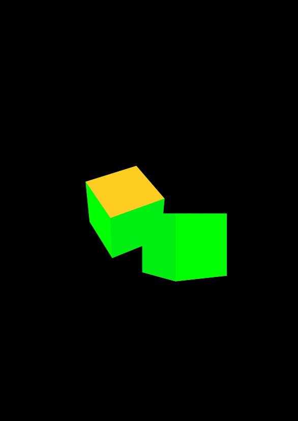
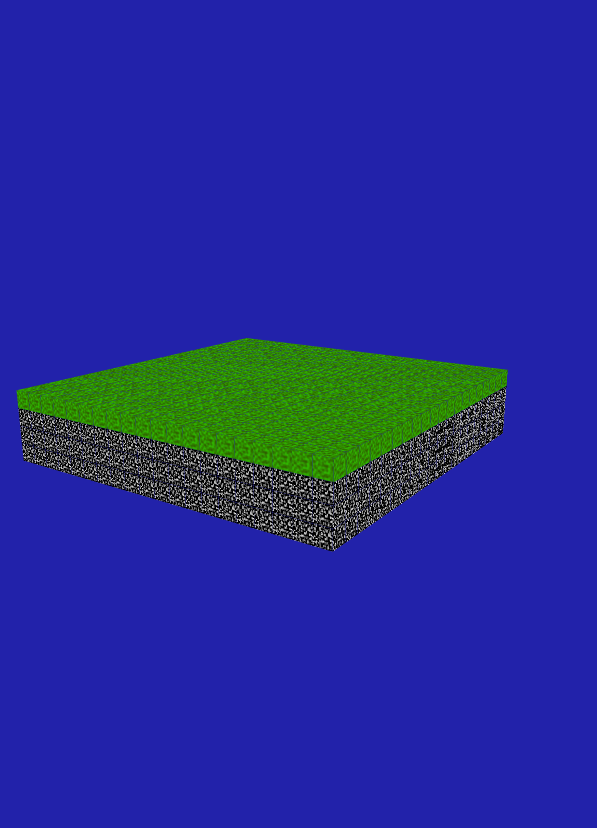
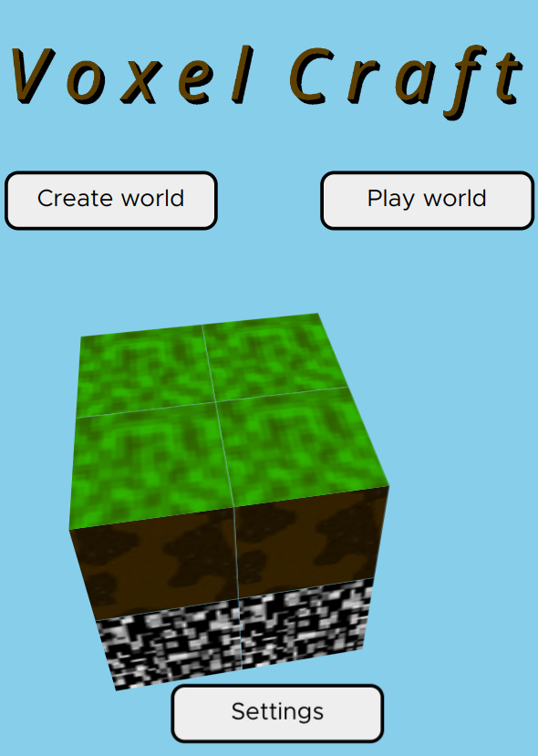
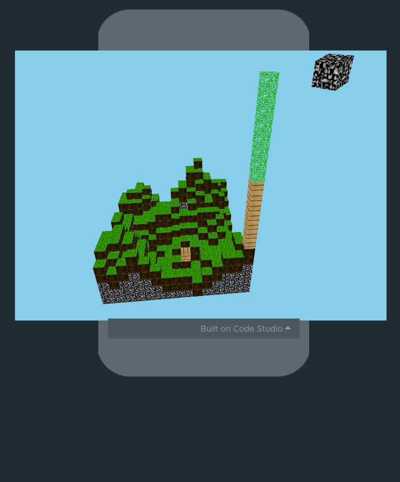

# Voxel HTML

A voxel game engine writen for Applab in code.org for a school project. The end result is a fully 3d, realtime, voxel graphics engine. 
The base movement controls should be consitent between all the testing iterations.

All assets and code were designed by me, and is released under the GPL v3 license. 

## Controls:

WASD to move
Shift for down, space for up
Left, right, up, and down arrows to look around
Enter to place, delete to delete blocks.

## Expermentation history:

|  name  |  Image with a link |
| -------|--------------------|
| Canvas 3d perspecitve testing  |  |
| Canvas 3d perspecitve testing with boxes |  |
| Using html/css injection to achive full realtime, scalable, textured 3d |  |
| Basic world rendering in html/css |  |
| Mostly complete game |  |
| Full game |  |
